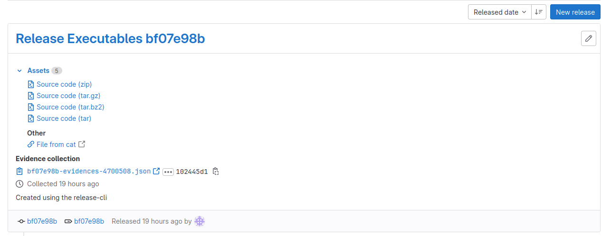

GitLab CI/CD is an essential tool that allows developers to automate their software delivery process. It offers various features that facilitate the entire process, from building and testing to deploying and monitoring. In this article, we will focus on GitLab CI/CD Releases with build.

To begin with, let's consider a minimal example of creating a new GitLab project that consists of three files: fileconc1.txt, fileconc2.txt, and .gitlab-ci.yml. The objective of this project is to concatenate the contents of the two text files and create a downloadable release.

The fileconc1.txt and fileconc2.txt files contain simple text contents, and the .gitlab-ci.yml file contains the pipeline configuration.

## Code for minimal example
Content of `fileconc1.txt`
```
This is a 
```

Content of `fileconc2.txt`
```
Textfile!! 
```

Content of the `.gitlab-ci.yml`

```yml

stages:
  - build
  - release

build-job:
  stage: build
  script:
    - echo "Compiling the code..."
    # get the job id and save it as environment statement
    - echo BUILD_JOB_ID=$CI_JOB_ID >> CI_JOB_ID.env
    - mkdir build
    - cat fileconc1.txt fileconc2.txt > build/file.txt
    - echo "Compile completed."
  artifacts:
    paths:
    - "build/file.txt"
    reports:
      # export the environment statement so we can access it in the release stage
      dotenv: CI_JOB_ID.env
release-job:
  stage: release
  image: registry.gitlab.com/gitlab-org/release-cli:latest
  needs:
    - job: build-job
      artifacts: true
  script:
    - echo "release application..."
    - echo "Application successfully released."
  release:
    name: 'Release Executables $CI_COMMIT_SHORT_SHA'
    description: 'Created using the release-cli'
    # tag_name is a memandatory field and can not be an empty string
    tag_name: '$CI_COMMIT_SHORT_SHA'
    assets:
      links:
        - name: 'File from cat'
          # Use variables to build a URL to access the artifacts
          # ${CI_PROJECT_URL} is the repository URL
          # ${BUILD_JOB_ID} is from the previous job,
          # the build stage, that contains the artifact
          url: '${CI_PROJECT_URL}/-/jobs/${BUILD_JOB_ID}/artifacts/file/build/file.txt'
  only:
    - main # only execute the release if the pipeline runs for the main branch

```

The gitlab-ci.yml file defines two stages, "build" and "release". The "build" stage compiles the code by concatenating the contents of the two text files and saves the output to a file in a directory named "build". It also creates an environment statement BUILD_JOB_ID=$CI_JOB_ID using the job ID to use it later in the release stage. In the artifact section, it exports the environment statement so we can access it in the release stage.

The "release" stage releases the application using the GitLab release-cli image. It requires the "build" stage to be executed successfully by using needs. The script in the release stage echoes the release application and successfully released the application. In the release section, it creates a name and description for the release and specifies the tag name. It also specifies the URL to access the artifacts in the assets section.

## Crafting the URL

One tricky part of using GitLab CI/CD Releases with build is generating the URL to access the artifact in the release stage. In the example given, the URL is generated using a combination of the GitLab project URL (CI_PROJECT_URL), the job ID of the build stage (BUILD_JOB_ID), and the artifact path (/artifacts/file/build/file.txt).

To obtain the BUILD_JOB_ID, we used an environment statement in the build stage: BUILD_JOB_ID=$CI_JOB_ID. This statement saves the job ID of the build stage in an environment variable named BUILD_JOB_ID. We then exported this environment variable using the artifact section dotenv: CI_JOB_ID.env so that we could access it in the release stage.

Using this environment variable, we can generate the URL to access the artifact in the release stage by combining it with the GitLab project URL and the artifact path. In the example given, the artifact path is /artifacts/file/build/file.txt, which specifies the location of the file in the artifact archive.

The resulting URL would look something like this: https://gitlab.com/myusername/myproject/-/jobs/123/artifacts/file/build/file.txt, where myusername is the username of the GitLab user, myproject is the name of the GitLab project, 123 is the job ID of the build stage, and /artifacts/file/build/file.txt is the path to the artifact file.

By using this URL, users can easily download the artifact that was created in the build stage. This is useful for distributing software releases or other types of files to users.

In conclusion, generating the URL to access artifacts in the release stage can be a bit tricky, but by using environment variables like BUILD_JOB_ID and combining them with the GitLab project URL and artifact path, we can easily create a URL that users can use to download our artifacts.

## Results

Finally, we can see the results of our pipeline in the "Deployments > Releases" page, where we find our release with the file "File from cat" that we released, which can be downloaded here.

In summary, GitLab CI/CD Releases with build is a powerful tool that enables developers to automate their software delivery process. By following a few simple steps, we can quickly create a pipeline that compiles our code, creates a downloadable release, and makes it available for our users.


